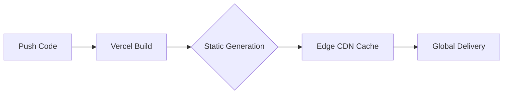

# IMAGINE Entertainment | Official Web Ecosystem

<div align="center">
  <p align="center">
    <strong>A high-caliber, full-stack digital experience for the premium entertainment industry.</strong>
  </p>
  <p align="center">
    <a href="https://nextjs.org/"></a>
    <a href="https://supabase.com/"></a>
    <a href="https://cloudinary.com/"></a>
    <a href="https://vercel.com/"></a>
  </p>
</div>

---

## 📖 Table of Contents
- [Project Vision](#-project-vision)
- [System Architecture](#-system-architecture)
- [Premium Tech Stack](#-premium-tech-stack)
- [Key Features](#-key-features)
- [Design Philosophy](#-design-philosophy)
- [Deployment & Operations](#-deployment--operations)
- [Installation Guide](#-installation-guide)
- [Support](#-support)

---

## 🎯 Project Vision

The IMAGINE Entertainment platform is engineered to bridge the gap between high-end visual storytelling and robust enterprise management. It serves two primary audiences:
1. **The Clients**: Global brands and VIPs seeking top-tier entertainment services via a lightning-fast, visually stunning portfolio.
2. **The Agency**: Professional staff managing a dynamic schedule of high-stakes events through a secure, intuitive administrative terminal.

---

## 🏗 System Architecture

The ecosystem utilizes a **Next.js App Router** architecture with clear physical separation of concerns through Route Groups.

### 🌐 Public Facing (SSG)
- **Speed-First**: Pre-rendered static pages ensure near-instantaneous load times (TTFB < 50ms).
- **SEO Optimized**: Dynamic metadata generation for every event and gallery item.
- **Responsiveness**: Fluid layouts that adapt perfectly from 8K displays to mobile devices.

### 🛡 Administrative Terminal (SSR + Edge)
- **Secure Access**: Multi-factor ready authentication via Supabase Auth.
- **Real-Time Control**: Instant updates to the portfolio via server actions.
- **Audit Logging**: Every administrative action is logged for security and accountability.

---

## 🛠 Premium Tech Stack

| Category | Technology | Purpose |
| :--- | :--- | :--- |
| **Foundation** | `Next.js 16` | Hybrid rendering (SSG + SSR) for peak performance. |
| **Logic** | `React 19` | The latest in UI state management and server components. |
| **Database** | `PostgreSQL` | Relational data integrity via Supabase. |
| **Aesthetics** | `Tailwind CSS` | High-precision styling with consistent design tokens. |
| **Motion** | `GSAP / Framer` | Premium micro-interactions and cinematic transitions. |
| **Images** | `Cloudinary` | Intelligent AI-driven optimization and CDN delivery. |

---

## ✨ Key Features

- 🚀 **Turbo-Charged Performance**: Optimized for Core Web Vitals (LCP, FID, CLS).
- 🖼 **AI Image Pipeline**: Automatic format selection (AVIF/WebP) and smart cropping.
- 📊 **Live Analytics**: Visualized traffic data and event engagement metrics.
- 📧 **Enterprise Mail**: Automated confirmation and contact systems via Secure SMTP.
- 🔄 **Self-Healing DB**: Automated keep-alive crons to prevent database dormancy.
- 📱 **Mobile Mastery**: A true mobile-first approach for event attendees on the go.

---

## 🎨 Design Philosophy

Our design system is built on four pillars:
1. **Lustrous Simplicity**: Minimalist aesthetics that prioritize high-resolution content.
2. **Kinetic Feedback**: Every user action is met with subtle, premium motion.
3. **Accessibility**: AA-level compliance for diverse user groups.
4. **Dark Mode Excellence**: A sophisticated dark palette designed for late-night event browsing.

---

## 🚀 Deployment & Operations

The platform is optimized for **Global Edge Deployment**.

### Build Pipeline


### Database Maintenance
- **Health Check**: Every 72 hours via `/api/keep-alive`.
- **Backup**: Daily snapshots provided by Supabase.
- **Security**: Weekly dependency audits via automated linting.

---

## 📥 Installation Guide

### Development Setup
1. **Clone & Install**:
   ```bash
   git clone [repository-url]
   npm install
   ```

2. **Environment Configuration**:
   Create a `.env.local` based on the provided enterprise requirements:
   - `NEXT_PUBLIC_SUPABASE_URL`
   - `CLOUDINARY_API_KEY`
   - `SMTP_ENCRYPTION_PASS`

3. **Execution**:
   ```bash
   npm run dev
   ```

---

## 🤝 Support & Handoff

This project includes a comprehensive `CLIENT_HANDOVER.md` for account transitions and `ARCHITECTURE.md` for deep technical diving.

**Technical Support**: [developers@imaginesl.com](mailto:developers@imaginesl.com)
**Project Lead**: Imagine Entertainment SL

---
<p align="center">
  <em>Excellence in Entertainment, Mastered in Digital.</em>
</p>
